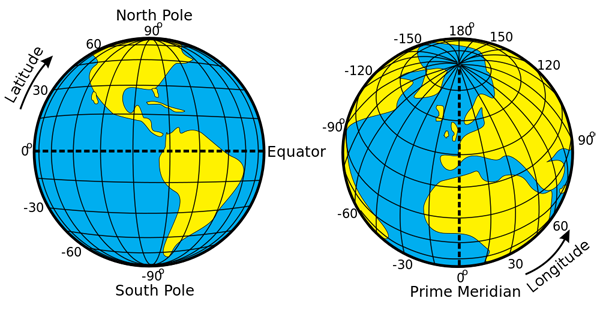
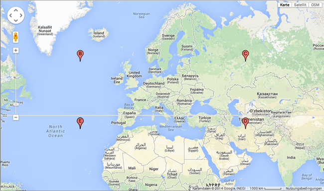
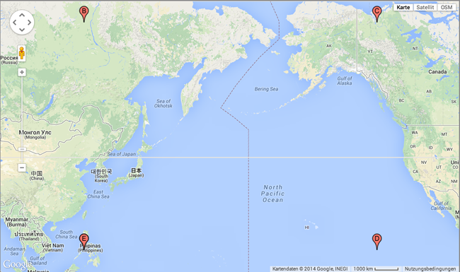
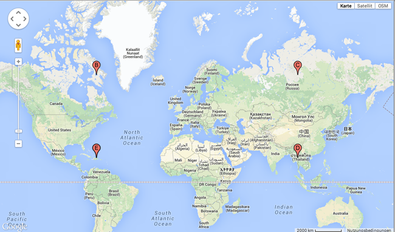
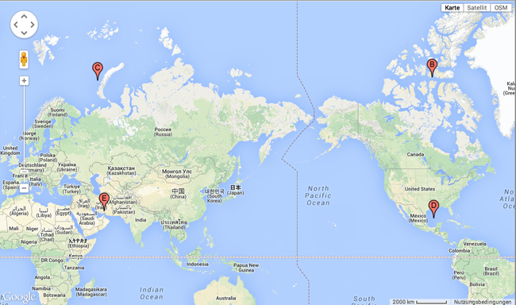
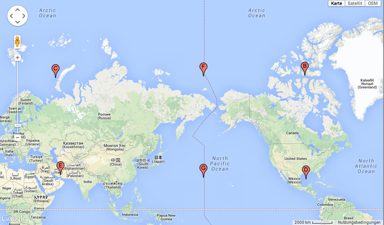

Mongo Antimeridian
====================

This approach describes a solution how to do reliable Mongo DB geo queries for a geometry shape, a bounding box in particular. 


###The earths coordinate system
 

###The definition of antimeridian
The 180th meridian or antimeridian is the meridian which is 180° east or west of the Prime Meridian with which it forms a great circle. It is common to both east longitude and west longitude. It is used as the basis for the International Date Line because it for the most part passes through the open waters of the Pacific Ocean. However, the meridian passes through Russia and Fiji as well as Antarctica.

###Preconditions
1. Specify coordinates in longitude, latitude order
2. Geospatial 2d index
3. The bounding box consists of 4 lat/lon pairs lower left, upper left, upper right and lower right

##Use Cases
This chapter describes possible use cases for geographical queries.

#####1. The bounding box fit within the half sphere and does not overlap the antimeridian

``` 
<?xml version="1.0" encoding="UTF-8" standalone="no" ?>
	<gpx xmlns="http://www.topografix.com/GPX/1/1" creator="gpxutils" version="1.1"
     xmlns:xsi="http://www.w3.org/2001/XMLSchema-instance"
     xsi:schemaLocation="http://www.topografix.com/GPX/1/1 http://www.topografix.com/GPX/1/1/gpx.xsd">
  <wpt lat="35.60190700" lon="-28.30564628"><name>lowerLeft</name></wpt>
  <wpt lat="58.60717297" lon="-28.30564628"><name>upperLeft</name></wpt>
  <wpt lat="58.60717297" lon="56.06935372"><name>upperRight</name></wpt>
  <wpt lat="35.60190700" lon="56.06935372"><name>lowerRight</name></wpt>
  <wpt lat="35.60190700" lon="-28.30564628"><name>lowerLeft</name></wpt>
</gpx>
``` 
 

In this case we can use the $geoWithin plus the shape operator $box or $polygon

```
db.<collection>.find({ <location field> : { $geoWithin : { $box :
											[ [ <bottom left coordinates> ] ,
									        [ <upper right coordinates> ] ] } } })
```

```
db.<collection>.find({ <location field> : { $geoWithin : { $polygon :
											[ [ <coordinate 1> ] ,
												...
									        [ <coordinate n> ], [ <coordinate 1> ] ] } } })
```

#####2. The bounding box fit within the half sphere and overlaps the antimeridian

``` 
<?xml version="1.0" encoding="UTF-8" standalone="no" ?>
<gpx xmlns="http://www.topografix.com/GPX/1/1" creator="gpxutils" version="1.1"
     xmlns:xsi="http://www.w3.org/2001/XMLSchema-instance"
     xsi:schemaLocation="http://www.topografix.com/GPX/1/1 http://www.topografix.com/GPX/1/1/gpx.xsd">
  <wpt lat="11.73292000" lon="120.58594000"><name>lowerLeft</name></wpt>
  <wpt lat="67.95609000" lon="120.58594000"><name>upperLeft</name></wpt>
  <wpt lat="67.95609000" lon="-133.94531000"><name>upperRight</name></wpt>
  <wpt lat="11.73292000" lon="-133.94531000"><name>lowerRight</name></wpt>
  <wpt lat="11.73292000" lon="120.58594000"><name>lowerLeft</name></wpt>
</gpx>
``` 
 

In this case we can use the $geoWithin plus the shape operator $polygon


```
db.<collection>.find({ <location field> : { $geoWithin : { $polygon :
											[ [ <coordinate 1> ] ,
												...
									        [ <coordinate n> ], [ <coordinate 1> ] ] } } })
```


#####3. The bounding box does not fit within the half sphere and does not overlap the antimeridian

``` 
<?xml version="1.0" encoding="UTF-8" standalone="no" ?>
<gpx xmlns="http://www.topografix.com/GPX/1/1" creator="gpxutils" version="1.1"
     xmlns:xsi="http://www.w3.org/2001/XMLSchema-instance"
     xsi:schemaLocation="http://www.topografix.com/GPX/1/1 http://www.topografix.com/GPX/1/1/gpx.xsd">
  <wpt lat="20.40433203" lon="-70.49314628"><name>lowerLeft</name></wpt>
  <wpt lat="66.52112807" lon="-70.49314628"><name>upperLeft</name></wpt>
  <wpt lat="66.52112807" lon="98.25685372"><name>upperRight</name></wpt>
  <wpt lat="20.40433203" lon="98.25685372"><name>lowerRight</name></wpt>
  <wpt lat="20.40433203" lon="-70.49314628"><name>lowerLeft</name></wpt>
</gpx>
``` 
 

In this case we can use the $geoWithin plus the shape operator $box

```
db.<collection>.find({ <location field> : { $geoWithin : { $box :
											[ [ <bottom left coordinates> ] ,
									        [ <upper right coordinates> ] ] } } })
```


#####4. The bounding box does not fit within the half sphere and overlaps the antimeridian

``` 
<?xml version="1.0" encoding="UTF-8" standalone="no" ?>
<gpx xmlns="http://www.topografix.com/GPX/1/1" creator="gpxutils" version="1.1"
     xmlns:xsi="http://www.w3.org/2001/XMLSchema-instance"
     xsi:schemaLocation="http://www.topografix.com/GPX/1/1 http://www.topografix.com/GPX/1/1/gpx.xsd">
  <wpt lat="28.70791000" lon="56.06935000"><name>lowerLeft</name></wpt>
  <wpt lat="74.78103000" lon="56.06935000"><name>upperLeft</name></wpt>
  <wpt lat="74.78103000" lon="-93.69627000"><name>upperRight</name></wpt>
  <wpt lat="28.70791000" lon="-93.69627000"><name>lowerRight</name></wpt>
  <wpt lat="28.70791000" lon="56.06935000"><name>lowerLeft</name></wpt>
</gpx>
``` 
 

This is the most complex case, because we need two bounding box queries and combine the results to one set.
The following figure denotes the two bounding boxes for the $geoWithin query.

 
	
```
db.<collection>.find({ <location field> : { $geoWithin : { $box :
											[ [ <bottom left coordinates (E)> ] ,
									        [ <upper right coordinates> (F)] ] } } })
```

```
db.<collection>.find({ <location field> : { $geoWithin : { $box :
											[ [ <bottom left coordinates (G)> ] ,
									        [ <upper right coordinates> (B)] ] } } })
```

Make sure that the coordinates don't hit the -180.0 or +180.0 exactly. An abbrevation of at least 0.00001 is needed for the mongoDB query.


